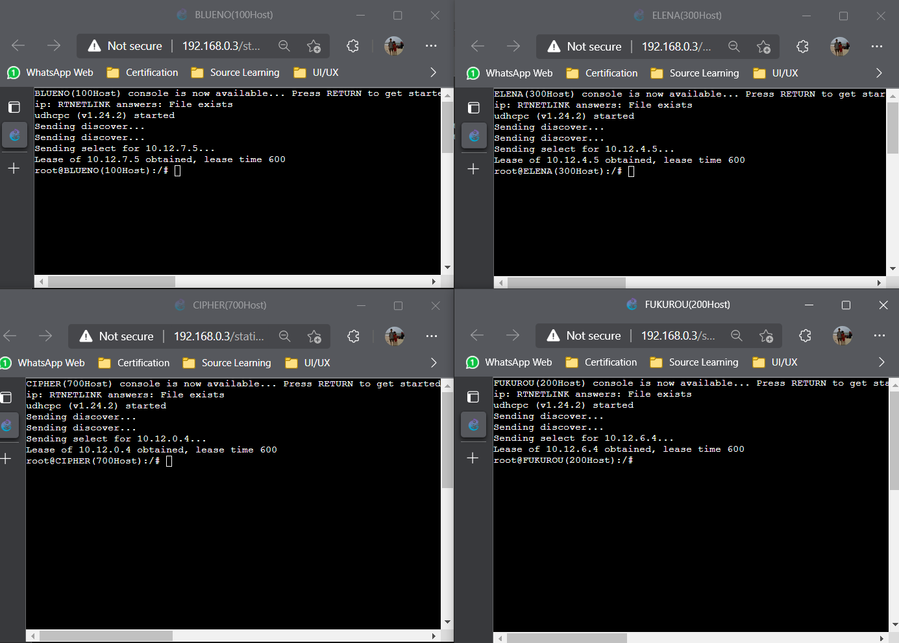

# Jarkom-Modul-5-B10-2021

## Anggota B10
Nama | NRP | Pembagian
------------ | ------------- | -------------
Pramudya Tiandana Wisnu Gautama | 05111940000018 | 1-6
Jason Andrew Gunawan | 05111940000085 | Persiapan
Frans Wijaya | 05111940000098 | Persiapan

## Daftar Isi
- [Jarkom-Modul-5-B10-2021](#jarkom-modul-5-b10-2021)
  * [Anggota B10](#anggota-b10)
  * [Daftar Isi](#daftar-isi)
  * [Topologi](#topologi)
  * [Konfigurasi](#konfigurasi)
    + [Soal B](#soal-b)
    + [Soal C](#soal-c)
    + [Soal D](#soal-d)
  * [GNS3](#gns3)
    + [Soal 1](#soal-1)
    + [Soal 2](#soal-2)
    + [Soal 3](#soal-3)
    + [Soal 4](#soal-4)
    + [Soal 5](#soal-5)
    + [Soal 6](#soal-6)
  * [Kendala](#kendala)

## Topologi
(A) Tugas pertama kalian yaitu membuat topologi jaringan sesuai dengan rancangan yang diberikan Luffy dibawah ini:


Keterangan :
- Doriki adalah DNS Server
- Jipangu adalah DHCP Server
- Maingate dan Jorge adalah Web Server
- Jumlah Host pada Blueno adalah 100 host
- Jumlah Host pada Cipher adalah 700 host
- Jumlah Host pada Elena adalah 300 host
- Jumlah Host pada Fukurou adalah 200 host

## Konfigurasi
### Soal B
Karena kalian telah belajar subnetting dan routing, Luffy ingin meminta kalian untuk membuat topologi tersebut menggunakan teknik CIDR atau VLSM. setelah melakukan subnetting,
#### **Jawaban**
Pada contoh ini, kami menggunakan pembagian IP dengan teknik VLSM. Berikut adalah tabel hasil pembagian IP yang kami lakukan.

| Subnet |          Note          | Jumlah IP | Length |
|:------:|:----------------------:|:---------:|:------:|
| A1     | Water7 Doriki Jipangu  | 3         | 29     |
| A2     | Water7 Blueno          | 101       | 25     |
| A3     | Water7 Cipher          | 701       | 22     |
| A4     | Water7 Foosha          | 2         | 30     |
| A5     | Foosha Guanhao         | 2         | 30     |
| A6     | Guanhao Elena          | 301       | 23     |
| A7     | Guanhao Fukurou        | 201       | 24     |
| A8     | Guanhao Maingate Jorge | 3         | 29     |
| Total  |                        | 1314      | 21     |

Sehingga, secara umum, berikut adalah pembagian topologi yang kami lakukan.


Setelahnya, kami melakukan pembagian pohon IP berdasarkan tabel subnet yang sudah dibuat. Pohon IP tersebut berbentuk sebagai berikut.


Sehingga, hasil akhir subnetting menggunakan VLSM adalah berikut.
| Subnet |          Note          | Jumlah IP | Length |       IP      |   Subnet Mask   |
|:------:|:----------------------:|:---------:|:------:|:-------------:|:---------------:|
| A1     | Water7 Doriki Jipangu  | 3         | 29     | 10.12.7.128 | 255.255.255.248 |
| A2     | Water7 Blueno          | 101       | 25     | 10.12.7.0   | 255.255.255.128 |
| A3     | Water7 Cipher          | 701       | 22     | 10.12.0.0   | 255.255.252.0   |
| A4     | Water7 Foosha          | 2         | 30     | 10.12.7.144 | 255.255.255.252 |
| A5     | Foosha Guanhao         | 2         | 30     | 10.12.7.148 | 255.255.255.252 |
| A6     | Guanhao Elena          | 301       | 23     | 10.12.4.0   | 255.255.254.0   |
| A7     | Guanhao Fukurou        | 201       | 24     | 10.12.6.0   | 255.255.255.0   |
| A8     | Guanhao Maingate Jorge | 3         | 29     | 10.12.7.136 | 255.255.255.248 |

### Soal C
Kalian juga diharuskan melakukan Routing agar setiap perangkat pada jaringan tersebut dapat terhubung.
#### **Jawaban**
Setelahnya, kami melakukan pembagian IP dan mengatur routing. Pembagian setting konfigurasi network adalah berikut.

Doriki
```
auto eth0
iface eth0 inet static
address 10.12.7.130
netmask 255.255.255.248
gateway 10.12.7.129
```

Jipangu
```
auto eth0
iface eth0 inet static
address 10.12.7.131
netmask 255.255.255.248
gateway 10.12.7.129
```

Blueno (100 Host)
```
auto eth0
iface eth0 inet static
address 10.12.7.2
netmask 255.255.255.128
gateway 10.12.7.1
```

Water7
```
auto lo
iface lo inet loopback

auto eth0
iface eth0 inet static
address 10.12.7.145
netmask 255.255.255.252
gateway 10.12.7.146

auto eth1
iface eth1 inet static
address 10.12.7.129
netmask 255.255.255.248

auto eth2
iface eth2 inet static
address 10.12.7.1
netmask 255.255.255.128

auto eth3
iface eth3 inet static
address 10.12.0.1
netmask 255.255.252.0
```

Cipher
```
auto eth0
iface eth0 inet static
address 10.12.0.2
netmask 255.255.252.0
gateway 10.12.0.1
```

Foosha dengan ip 192.168.122.55
```
auto lo
iface lo inet loopback

auto eth0
iface eth0 inet dhcp
hwaddress ether aa:7c:cc:71:e7:3a

auto eth1
iface eth1 inet static
address 10.12.7.146
netmask 255.255.255.252

auto eth2
iface eth2 inet static
address 10.12.7.149
netmask 255.255.255.252
```

Jorge
```
auto eth0
iface eth0 inet static
address 10.12.7.138
netmask 255.255.255.248
gateway 10.12.7.137
```

Maingate
```
auto eth0
iface eth0 inet static
address 10.12.7.139
netmask 255.255.255.248
gateway 10.12.7.137
```

Elena
```
auto eth0
iface eth0 inet static
address 10.12.4.2
netmask 255.255.254.0
gateway 10.12.4.1
```

Guanhao
```
auto lo
iface lo inet loopback

auto eth0
iface eth0 inet static
address 10.12.7.150
netmask 255.255.255.252
gateway 10.12.7.149

auto eth1
iface eth1 inet static
address 10.12.7.137
netmask 255.255.255.248

auto eth2
iface eth2 inet static
address 10.12.4.1
netmask 255.255.254.0

auto eth3
iface eth3 inet static
address 10.12.6.1
netmask 255.255.255.0
```

Fukurou
```
auto eth0
iface eth0 inet static
address 10.12.6.2
netmask 255.255.255.0
gateway 10.12.6.1
```

Contoh di atas, diasumsikan client tidak diatur IP-nya oleh DHCP.

Setelah itu, kami mengatur routing keseluruhan topologi. Dengan menjalankan `inet.sh` pada Foosha, kita sudah dapat melakukan ping terhadap luar topologi di semua node. Sebagai tambahan, kami juga menambahkan pengaturan internet tanpa `MASQUERADE` di mana sesuai untuk nomor 1.
```
#!/bin/bash
# teknik routing
# kiri
route add -net 10.12.7.128 netmask 255.255.255.248 gw 10.12.7.145
route add -net 10.12.7.0 netmask 255.255.255.128 gw 10.12.7.145
route add -net 10.12.0.0 netmask 255.255.252.0 gw 10.12.7.145

# kanan
route add -net 10.12.4.0 netmask 255.255.254.0 gw 10.12.7.150
route add -net 10.12.6.0 netmask 255.255.255.0 gw 10.12.7.150
route add -net 10.12.7.136 netmask 255.255.255.248 gw 10.12.7.150

# pengaturan internet tanpa MASQUERADE
iptables -t nat -A POSTROUTING -s 10.12.0.0/21 -o eth0 -j SNAT --to-source 192.168.122.55
```

Lalu, jalankan `access.sh` pada node-node lain.
```
#!/bin/bash
echo "nameserver 192.168.122.1" > /etc/resolv.conf
```

Sehingga pada seluruh node, kita dapat mengakses internet.


### Soal D
Tugas berikutnya adalah memberikan ip pada subnet Blueno, Cipher, Fukurou, dan Elena secara dinamis menggunakan bantuan DHCP server. Kemudian kalian ingat bahwa kalian harus setting DHCP Relay pada router yang menghubungkannya.
#### **Jawaban**

Ganti konfigurasi network pada node client, yakni Blueno, Cipher, Fukurou, dan Elena menjadi sebagai berikut.
```
auto lo
iface lo inet loopback

auto eth0
iface eth0 inet dhcp
```

Pada Jipangu, install server DHCP dengan menjalankan `server.sh`.
```
#!/bin/bash
apt-get update
apt-get install isc-dhcp-server -y
```

Tetap pada Jipangu, tambahkan `INTERFACES="eth0"` dalam `/etc/default/isc-dhcp-server`.

Serta dalam `/etc/dhcp/dhcpd.conf`, tambahkan.
```
# Blueno A2
subnet 10.12.7.0 netmask 255.255.255.128 {
	range 10.12.7.2 10.12.7.126;
	option routers 10.12.7.1;
	option broadcast-address 10.12.7.127;
	option domain-name-servers 10.12.7.130;
	default-lease-time 600;
	max-lease-time 7200;
}

# Cipher A3
subnet 10.12.0.0 netmask 255.255.252.0 {
	range 10.12.0.2 10.12.3.254;
	option routers 10.12.0.1;
	option broadcast-address 10.12.3.255;
	option domain-name-servers 10.12.7.130;
	default-lease-time 600;
	max-lease-time 7200;
}

# Elena A6
subnet 10.12.4.0 netmask 255.255.254.0 {
	range 10.12.4.2 10.12.5.254;
	option routers 10.12.4.1;
	option broadcast-address 10.12.5.255;
	option domain-name-servers 10.12.7.130;
	default-lease-time 600;
	max-lease-time 7200;
}

# Fukurou A7
subnet 10.12.6.0 netmask 255.255.255.0 {
	range 10.12.6.2 10.12.6.254;
	option routers 10.12.6.1;
	option broadcast-address 10.12.6.255;
	option domain-name-servers 10.12.7.130;
	default-lease-time 600;
	max-lease-time 7200;
}

# Dari Jipangu ke router
subnet 10.12.7.128 netmask 255.255.255.248 {
        option routers 10.12.7.129;
}
```

Selanjutnya, lakukan instalasi DHCP Relay pada node Water7 dan Guanhao dengan menjalankan `relay.sh`.
```
#!/bin/bash
apt-get update
apt-get install isc-dhcp-relay -y
service isc-dhcp-relay start
```

Saat installasi, pengaturan yang digunakan pada setting ini adalah sebagai berikut.
```
# What servers should the DHCP relay forward requests to?
SERVERS="10.12.7.131"

# On what interfaces should the DHCP relay (dhrelay) serve DHCP requests?
INTERFACES="eth0 eth1 eth2 eth3"

# Additional options that are passed to the DHCP relay daemon?
OPTIONS=""
```
Di mana pengaturan tersebut, dapat diakses di `/etc/default/isc-dhcp-relay`.

Lalu, restart dhcp-relay di node Water7 dan Guanhao.
```
service isc-dhcp-relay start
```

Restart dan cek status DHCP Server di Jipangu.
```
service isc-dhcp-server restart
service isc-dhcp-server status
```

Lalu, restart kembali node Blueno, Cipher, Elena, dan Fukurou. Selanjutnya, kita akan mendapati bahwa ip sudah berubah sesuai dengan pengaturan DHCP.


---

## GNS3
### Soal 1
Agar topologi yang kalian buat dapat mengakses keluar, kalian diminta untuk mengkonfigurasi Foosha menggunakan iptables, tetapi Luffy tidak ingin menggunakan MASQUERADE.
#### **Jawaban**

1. Sebagaimana dalam `soal C`, pengaturannya adalah sebagai berikut.
```
iptables -t nat -A POSTROUTING -s 10.12.0.0/21 -o eth0 -j SNAT --to-source 192.168.122.55
```

Didapatkan pula, hasilnya adalah.


### Soal 2
Kalian diminta untuk mendrop semua akses HTTP dari luar Topologi kalian pada server yang merupakan DHCP Server dan DNS Server demi menjaga keamanan.
#### **Jawaban**

Untuk mengatur DNS, install DNS Server di Doriki dengan menjalankan `dns.sh`.
```
#!/bin/bash
apt-get update
apt-get install bind9 -y
```

Ubah isi file pada `/etc/bind/named.conf.options`, agar sesuai dengan berikut.
```
options {
        directory "/var/cache/bind";

        // If there is a firewall between you and nameservers you want
        // to talk to, you may need to fix the firewall to allow multiple
        // ports to talk.  See http://www.kb.cert.org/vuls/id/800113

        // If your ISP provided one or more IP addresses for stable
        // nameservers, you probably want to use them as forwarders.
        // Uncomment the following block, and insert the addresses replacing
        // the all-0's placeholder.

        forwarders {
                192.168.122.1;
        };

        //========================================================================
        // If BIND logs error messages about the root key being expired,
        // you will need to update your keys.  See https://www.isc.org/bind-keys
        //========================================================================
        //dnssec-validation auto;
        allow-query{any;};

        auth-nxdomain no;    # conform to RFC1035
				listen-on-v6 { any; };
};
```

Lalu, restart DNS Server di Doriki.
```
service bind9 restart
```

Pada Foosha, jalankan `soal2.sh` agar semua akses HTTP langsung di-drop.
```
#!/bin/bash
iptables -A FORWARD -d 10.12.7.128/29 -i eth0 -p tcp --dport 80 -j DROP
```

Akhirnya, pada client dapat dijalankan kedua command berikut.
```
ping google.com
ping monta.if.its.ac.id
```

Hasil yang didapatkan adalah sebagai berikut.


### Soal 3
Karena kelompok kalian maksimal terdiri dari 3 orang. Luffy meminta kalian untuk membatasi DHCP dan DNS Server hanya boleh menerima maksimal 3 koneksi ICMP secara bersamaan menggunakan iptables, selebihnya didrop.
#### **Jawaban**
Pada Jipangu dan Doriki, jalankan `soal3.sh` agar membatasi akses koneksi yang dapat masuk.
```
#!/bin/bash
iptables -A INPUT -p icmp -m connlimit --connlimit-above 3 --connlimit-mask 0 -j DROP
```

Lantas di client, coba jalankan command berikut.
```
ping 10.12.7.131
```

Hasil dari menjalankan keempat client tersebut adalah berikut.


> Kemudian kalian diminta untuk membatasi akses ke Doriki yang berasal dari subnet Blueno, Cipher, Elena dan Fukuro dengan beraturan sebagai berikut:
### Soal 4
Akses dari subnet Blueno dan Cipher hanya diperbolehkan pada pukul 07.00 - 15.00 pada hari Senin sampai Kamis.
#### **Jawaban**

Pada Water7, batasi akses dengan menjalankan `soal4.sh`.
```
#!/bin/bash
iptables -A FORWARD -s 10.12.7.0/25,10.12.0.0/22 -m time --timestart 07:00 --timestop 15:00 --weekdays Mon,Tue,Wed,Thu -j ACCEPT
iptables -A FORWARD -s 10.12.7.0/25,10.12.0.0/22 -j REJECT
```

Sembari client Blueno dan Cipher menjalankan `ping google.com` ganti pengaturan waktu di Water7.
```
Senin
date -s "9 DEC 2021 08:00:00" -> bisa
date -s "9 DEC 2021 18:00:00" -> gagal

Sabtu
date -s "11 DEC 2021 09:00:00" -> gagal
```

Hasilnya tampak pada gambar berikut.


### Soal 5
Akses dari subnet Elena dan Fukuro hanya diperbolehkan pada pukul 15.01 hingga pukul 06.59 setiap harinya.
#### **Jawaban**
Pada Guanhao, jalankan `soal5.sh`.
```
iptables -A FORWARD -s 10.12.4.0/23,10.12.6.0/24 -m time --timestart 00:00 --timestop 06:59 -j ACCEPT
iptables -A FORWARD -s 10.12.4.0/23,10.12.6.0/24 -m time --timestart 15:01 --timestop 23:59 -j ACCEPT
iptables -A FORWARD -s 10.12.4.0/23,10.12.6.0/24 -j REJECT
```

Sembari client Elena dan Fukurou menjalankan `ping google.com` ganti pengaturan waktu di Guanhao.
```
date -s "11 DEC 2021 02:00:00" -> bisa
date -s "11 DEC 2021 14:00:00" -> gagal
```


> Selain itu di reject
### Soal 6
Karena kita memiliki 2 Web Server, Luffy ingin Guanhao disetting sehingga setiap request dari client yang mengakses DNS Server akan didistribusikan secara bergantian pada Jorge dan Maingate
#### **Jawaban**
Pada Jorge dan Maingate, lakukan installasi web server Apache dengan menjalankan `web-servers.sh`.
```
#!/bin/sh
apt-get update
apt-get install apache2 -y
service apache2 restart
```

Lalu, pada Jorge atau Maingate, ganti `/var/www/html/index.html` dengan nama node tersebut. Contoh pada Maingate.
```
<!DOCTYPE html>
<html>
  <head>
    <title>Maingate</title>
  </head>
  <body>
    <h1>Ini server Maingate</h1>
  </body>
</html>
```

Lalu, pada Guanhao, lakukan load balancing dengan menjalankan `soal6.sh`.
```
#!/bin/sh
iptables -A PREROUTING -t nat -p tcp -d 10.12.7.128/29 -m statistic --mode nth --every 2 --packet 0 -j DNAT --to-destination 10.12.7.138
iptables -A PREROUTING -t nat -p tcp -d 10.12.7.128/29 -j DNAT --to-destination 10.12.7.139
iptables -t nat -A POSTROUTING -p tcp -d 10.12.7.138 -j SNAT --to-source 10.12.7.128
iptables -t nat -A POSTROUTING -p tcp -d 10.12.7.139 -j SNAT --to-source 10.12.7.128
```

Sekarang, coba minta client akses IP Doriki dan client akan diarahkan ke Jorge dan Maingate secara bergantian.
```
curl 10.12.7.131
```

Hasil tersebut ditampilkan pada gambar berikut.


> Luffy berterima kasih pada kalian karena telah membantunya. Luffy juga mengingatkan agar semua aturan iptables harus disimpan pada sistem atau paling tidak kalian menyediakan script sebagai backup.
---
## Kendala
- Sudah masuk musim EAS, sehingga beberapa teman fokus mengerjakan EAS.
- Sulit membagi tugas karena hanya terdapat 1 file dan tidak bisa dikerjakan dalam waktu bersamaan.
